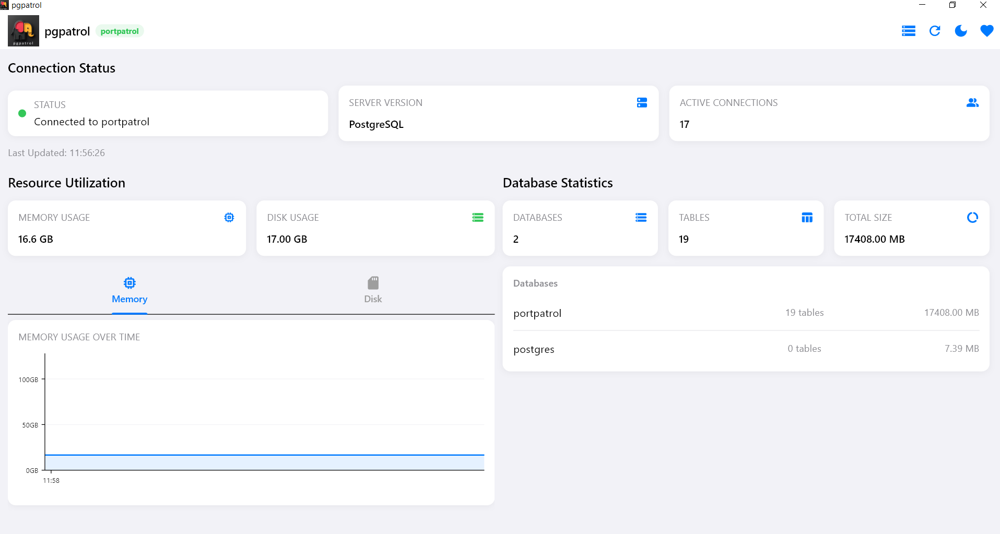
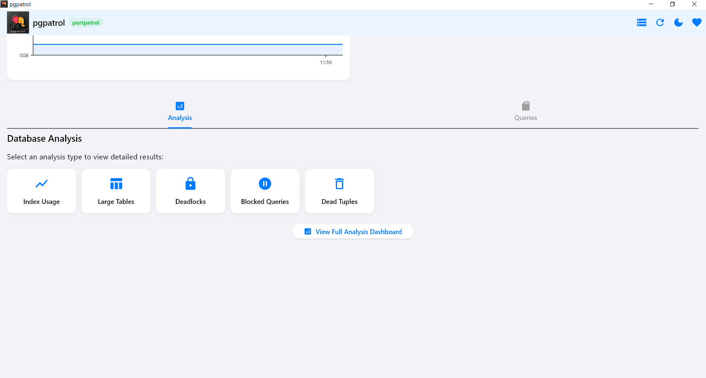
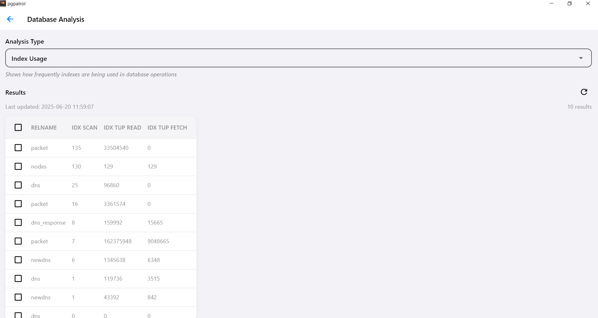
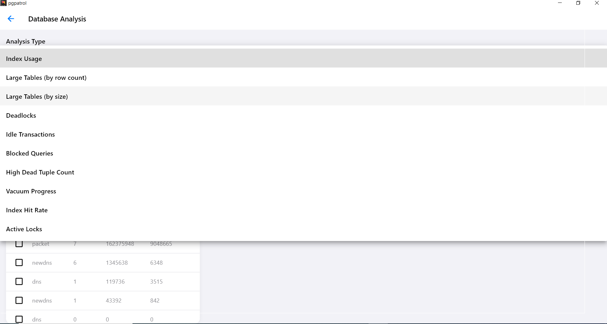
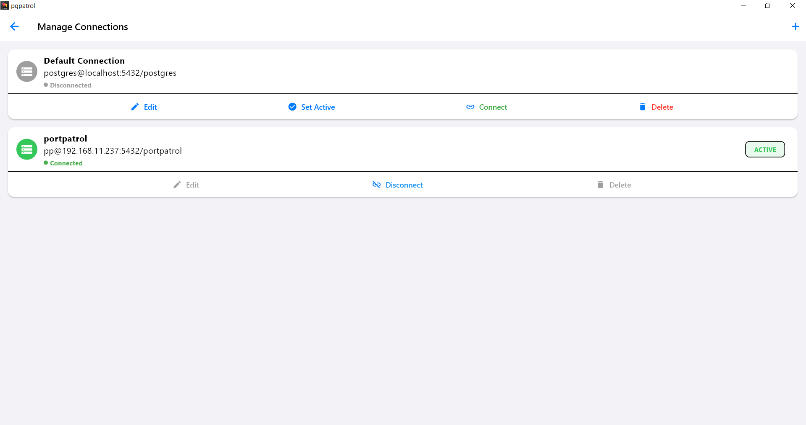

# pgpatrol

PostgreSQL monitoring app built with Flutter to support all platforms.


## Windows Desktop Build

Check availablity:

```
flutter doctor
```

Otherwiwe, make sure you have Visual Studio installed with the necessary components for Windows desktop development:

- Desktop development with C++

- Windows 10 SDK

```
flutter create .
```

Run 

```
flutter run -d windows
```

Build Desktop Exectutable

```
flutter build windows
flutter build windows --release
```

## Screen Shots











## Links

[PostgreSQL monitoring](https://www.postgresql.fastware.com/postgresql-insider-mon-met)